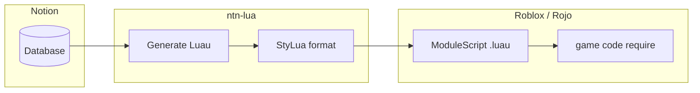

# NotionToLua

> **Make Notion the single source of truth for your game data.**  
> Stop maintaining spreadsheets and Luau in parallel — follow **Don't Repeat It Yourself (DRIY)** by keeping structure in Notion and syncing typed `ModuleScript` output into Roblox.

[](./LICENSE)
[](https://github.com/rojo-rbx/rokit)
[](https://nodejs.org/)

---

## Why NotionToLua?

In Roblox projects, balance data — weapon stats, enemy parameters, quest conditions — often lives in hand-written Luau tables or constants. Managing the same data separately in Notion leads to **double updates, type drift, and duplicate keys**.

NotionToLua flips that model:

| Principle | Meaning |
| --- | --- |
| **Single Source of Truth** | Edit records only in Notion. Luau is generated output. |
| **DRIY** | *Don't Repeat It Yourself* — never write the same data in code and spreadsheets. |
| **Enforced structure** | Title column becomes module keys, `export type` annotations, immediate errors on duplicates or missing titles. |



**`ntn-lua`** fetches every record from a Notion database and converts it into a Roblox Luau `ModuleScript`. Output goes to either a **Notion page code block** or a **local `.luau` file** (recommended: a Rojo-mapped path).

---

## Quick start (Rokit)

Install `ntn-lua` and StyLua with [Rokit](https://github.com/rojo-rbx/rokit), the toolchain manager for Roblox projects. StyLua is required because `ntn-lua` formats generated code with `stylua`.

```bash
# From your project root
rokit add Zac134/NotionToLua ntn-lua
rokit add JohnnyMorganz/StyLua
rokit install
```

The second argument (`ntn-lua`) is the command name on `PATH`. Without it, Rokit exposes the tool as `NotionToLua`.

Or add both to your project's `rokit.toml`:

```toml
[tools]
StyLua = "JohnnyMorganz/StyLua@2.5.2"
ntn-lua = "Zac134/NotionToLua@0.1.1"
```

```bash
rokit install
ntn-lua --help
```

### Environment variables

```bash
cp .env.example .env
```

| Variable | Required | Purpose |
| --- | --- | --- |
| `NOTION_API_TOKEN` | Yes | Notion integration internal secret |
| `NOTION_DATABASE_ID` | No | Default `database_id` or `data_source_id` |
| `NOTION_OUTPUT_DIR` | No | Default output path for file mode (directory or `.lua` / `.luau` file) |

The loader reads `process.cwd()/.env`, so run `ntn-lua` from the directory that contains your `.env` (typically the Rojo project root). Rokit binaries and the npm dev CLI behave the same.

Share target Notion pages and databases with the integration you use.

### First sync

```bash
# No arguments when NOTION_DATABASE_ID / NOTION_OUTPUT_DIR are set in .env
ntn-lua

# Or pass options explicitly
ntn-lua -d <DATABASE_ID> -o src/shared/Config/Weapons.luau
```

---

## Use in Roblox projects

This workflow assumes a [Rojo](https://github.com/rojo-rbx/rojo) project. Map generated files with `$path` and `require` them from game code.

```
my-game/
  .env
  rokit.toml
  default.project.json
  src/
    shared/
      Config/
        Weapons.luau   # generated by ntn-lua
```

Example `default.project.json`:

```json
{
  "name": "MyGame",
  "tree": {
    "$className": "DataModel",
    "ReplicatedStorage": {
      "Shared": {
        "$path": "src/shared"
      }
    }
  }
}
```

From game code:

```lua
local Weapons = require(game.ReplicatedStorage.Shared.Config.Weapons)

print(Weapons.Sword.Damage)
```

Run `ntn-lua` in CI or a pre-commit hook to keep Notion authoritative while Luau stays up to date under DRIY.

---

## Features

- **`ntn-lua` CLI** — Node.js 22 `parseArgs` (distributed as Bun-compiled binaries)
- **Full record fetch** — Notion API pagination
- **Type conversion** — Notion properties → Luau values with `export type`
- **Notion writes** — Find and update a `language = lua` code block, or append one (Luau in the UI is supported)
- **File output** — `--output` writes locally only (no Notion writes). Accepts a directory or `.lua` / `.luau` path
- **StyLua formatting** — Warn and continue on failure; skip with `--no-format`
- **Title column = record key** — Duplicate or empty values are errors
- **Unsupported properties** — Relation, Rollup, and similar types are skipped

### Linting (optional)

`ntn-lua` formats output with StyLua but does not run selene. Contract violations during conversion (duplicate keys, permission errors, and similar) exit non-zero. For additional linting, install [selene](https://github.com/Kampfkarren/selene) via Rokit and run it on generated files.

---

## Usage

### Priority

- **Database ID:** `-d` / `--database-id` → positional argument → `NOTION_DATABASE_ID`
- **Output path:** `-o` / `--output` → `NOTION_OUTPUT_DIR` (if unset, writes to a Notion code block)

### Write to a Notion code block (default)

```bash
ntn-lua -d <DATABASE_OR_DATA_SOURCE_ID>
# or
ntn-lua <DATABASE_OR_DATA_SOURCE_ID>
```

Target page resolution order:

1. `--page-id` (when provided)
2. `database_parent.page_id` on the data source
3. Walk parents from `database_parent.block_id` via `blocks.retrieve`
4. Error when unresolvable (for example, a database directly under the workspace)

```bash
ntn-lua -d <DATABASE_ID> -p <PAGE_ID>
```

If a database has multiple data sources, pass a `data_source_id` directly. The tool searches recursively for the first `lua` / `luau` code block on the page.

### Write to a local file

```bash
ntn-lua
ntn-lua -d <DATABASE_ID> -o ./output
ntn-lua -d <DATABASE_ID> -o ./output/Weapons.luau
```

- Directory output: file name is `{sanitized-data-source-title}.luau`
- File output: the path and base name (without extension) become the module variable name
- The output directory must already exist (it is not created automatically)
- With `--output`, nothing is written to Notion and `--page-id` is ignored (a warning is printed to stderr)

### Options

```bash
ntn-lua [-d <id>] [<database-id>] [-p <page-id>] [-o <dir-or-file>] [--no-format]
```

| Option | Description |
| --- | --- |
| `<database-id>` | Positional database or data source ID when `-d` is omitted |
| `-d, --database-id` | Source `database_id` or `data_source_id` |
| `-p, --page-id` | Notion page ID for the code block (ignored in file output mode) |
| `-o, --output` | Output directory or `.lua` / `.luau` file path |
| `--no-format` | Skip Stylua formatting |
| `-h, --help` | Show help |

---

## Type conversion

| Notion type | Luau |
| --- | --- |
| Number | `number` |
| Checkbox | `boolean` |
| Rich Text | `string` |
| Select | `string` |
| Multi Select | `{ "a", "b" }` |
| Date | ISO 8601 string |
| URL | `string` |
| Formula | Converted from the evaluated result type |
| Status | `string` |
| Empty | Omitted from output (stored as `nil`) |

Unsupported types (Relation, Rollup, Files, People, and others) are skipped.

Generated `export type` fields use `?` when a property is missing on some records but present on others. Property names and record keys that are not valid Luau identifiers use bracket notation (for example, `["my-item"]`).

---

## Output example

Notion database:

| Name | Damage | Cooldown |
| --- | --- | --- |
| Sword | 25 | 1.2 |
| Axe | 40 | 2 |

Generated output with `ntn-lua -o ./output/Weapons.luau`:

```lua
export type WeaponsEntry = {
    Cooldown: number,
    Damage: number,
}

export type Weapons = {
    Axe: WeaponsEntry,
    Sword: WeaponsEntry,
}

local Weapons: Weapons = {
    Axe = {
        Cooldown = 2,
        Damage = 40,
    },
    Sword = {
        Cooldown = 1.2,
        Damage = 25,
    },
}

return Weapons
```

---

## Requirements

### End users (Rokit)

- [Rokit](https://github.com/rojo-rbx/rokit)
- [StyLua](https://github.com/JohnnyMorganz/StyLua) (`ntn-lua` spawns `stylua`; install both via Rokit)
- `NOTION_API_TOKEN`
- Target pages and databases shared with your Notion integration

### Developers

- Node.js 22+
- npm 10.9.2+
- StyLua (optional during development; warns and outputs unformatted code if missing)

---

## Development

```bash
npm install
npm run build      # tsc
npm run check      # type check
npm test           # unit tests
```

During development (no build required):

```bash
npm run sync
npm run sync -- -o ./other
npm run sync -- 3a94b589fd86808d9d64d7c99ce91844
```

After building:

```bash
npm run build
npx ntn-lua
```

### Project layout

```
src/
  cli.ts            # CLI entry
  env.ts            # .env loader
  generate.ts       # orchestration
  resolve-page.ts   # Notion write target
  stylua.ts         # formatting
  file-output.ts    # file output
  notion-client.ts  # client factory
  notion.ts         # API & property conversion
  generator.ts      # ModuleScript generation
  formatter.ts      # value / key formatting
  module-name.ts    # name sanitization
  blocks.ts         # code block update
  types.ts          # shared types
  errors.ts         # error handling
tests/
```

The `ModuleGenerator` interface in `generator.ts` and the `CodeBlockUpdater` interface in `blocks.ts` allow future changes such as splitting ModuleScripts or swapping output targets.

---

## Errors

Clear messages are returned for cases such as:

- Missing, empty, or duplicate title property values
- Database or page not found
- Data fetch or write failures
- Insufficient integration permissions
- Output directory missing or not writable
- Multiple data sources on one database without a direct `data_source_id`
- Unresolvable write target page (for example, workspace-root database without `--page-id`)

---

## Building binaries (maintainers)

Release artifacts are standalone Bun-compiled binaries packaged as Rokit-compatible zip files. End users only need Rokit (see [Quick start](#quick-start-rokit)).

Prerequisites: [Bun](https://bun.sh) on `PATH`, and `zip` or Python 3

```bash
npm run compile -- 0.1.1 bun-darwin-arm64 ./release
```

| `bun-target` | Zip suffix |
| --- | --- |
| `bun-linux-x64` | `linux-x86_64` |
| `bun-linux-arm64` | `linux-aarch64` |
| `bun-darwin-x64` | `macos-x86_64` |
| `bun-darwin-arm64` | `macos-aarch64` |
| `bun-windows-x64` | `windows-x86_64` |
| `bun-windows-arm64` | `windows-aarch64` |

Output: `NotionToLua-<version>-<os>-<arch>.zip` containing a single `NotionToLua` (or `NotionToLua.exe` on Windows) binary. Rokit installs that binary and links it on `PATH` as `ntn-lua` when your `rokit.toml` uses the `ntn-lua` alias.

### Release checklist

1. Confirm tests pass: `npm test`
2. Tag and push:
   ```bash
   git tag v0.1.1
   git push origin v0.1.1
   ```
3. GitHub Actions builds all six targets and attaches zip assets to the Release
4. Verify from a clean Roblox project:
   ```bash
   rokit add Zac134/NotionToLua@0.1.1 ntn-lua
   rokit add JohnnyMorganz/StyLua
   rokit install
   ntn-lua --help
   ```

---

## License

MIT License. See [LICENSE](./LICENSE) for details.
