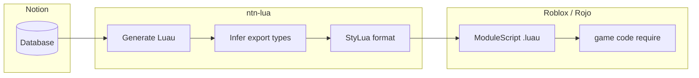

# NotionToLua

> **Make Notion the single source of truth for your game data.**  
> Stop maintaining spreadsheets and Luau in parallel — follow **Don't Repeat It Yourself (DRIY)** by keeping structure in Notion and syncing typed `ModuleScript` output into Roblox.

[](./LICENSE)
[](https://github.com/rojo-rbx/rokit)

---

## Why NotionToLua?

In Roblox projects, balance data — weapon stats, enemy parameters, quest conditions — often lives in hand-written Luau tables or constants. Managing the same data separately in Notion leads to **double updates, type drift, and duplicate keys**.

NotionToLua flips that model:

| Principle | Meaning |
| --- | --- |
| **Single Source of Truth** | Edit records only in Notion. Luau is generated output. |
| **DRIY** | *Don't Repeat It Yourself* — never write the same data in code and spreadsheets. |
| **Enforced structure** | Title column becomes module keys, `export type` annotations, immediate errors on duplicates or missing titles. |



**`ntn-lua`** fetches every record from a Notion database and converts it into a Roblox Luau `ModuleScript`. Output goes to either a **Notion page code block** or a **local `.luau` file** (recommended: a Rojo-mapped path).

---

## Quick start

NotionToLua is distributed for [Rokit](https://github.com/rojo-rbx/rokit), the toolchain manager for Roblox projects. Install `ntn-lua` and StyLua together — StyLua is required because `ntn-lua` formats generated code with `stylua`.

```bash
# From your Rojo project root
rokit add Zac134/NotionToLua ntn-lua
rokit add JohnnyMorganz/StyLua
rokit install
```

The second argument (`ntn-lua`) is the command name on `PATH`. Without it, Rokit exposes the tool as `NotionToLua`.

Or add both to your project's `rokit.toml`:

```toml
[tools]
StyLua = "JohnnyMorganz/StyLua@2.5.2"
ntn-lua = "Zac134/NotionToLua@0.4.0"
```

```bash
rokit install
ntn-lua --help
```

### Setup

From your Rojo project root:

1. Create a `.env` file with your Notion integration secret (see below).
2. Generate `ntn-lua.toml`:

```bash
ntn-lua init
```

3. Edit `ntn-lua.toml` — set `database_id` and `output` at minimum.

Both files are read from `process.cwd()`, so run `ntn-lua` from the directory that contains them (typically the Rojo project root). `ntn-lua.toml` is **recommended** but **not required** when you pass `-d` / `-o` on the CLI.

Create a Notion integration and connect your database before the first sync — expand **Notion setup** below.

<a id="notion-setup"></a>
<details>
<summary><strong>Notion setup — create an integration and connect your database</strong></summary>

1. **Create an integration** at [notion.so/my-integrations](https://www.notion.so/my-integrations). Choose **Internal** integration.

2. **Copy the Internal Integration Secret** into `.env` as `NOTION_API_TOKEN`.

3. **Capabilities** (integration settings → Capabilities):
   - **Read content** — required for pull (fetch database records)
   - **Update content** and **Insert content** — required when writing to a Notion code block (default pull output without `-o`), or when using **`ntn-lua push`**

4. **Share your database** with the integration: open the database → **⋯** → **Connections** / **Share** → **Invite** → select your integration. For code block mode or **`ntn-lua push`**, also share the parent page where the database or code block should be created.

5. **Database ID**: copy from the database URL — the 32-character hex segment (hyphens optional). If the database has multiple data sources, pass a `data_source_id` directly (see [Usage](#write-to-a-notion-code-block-default)).

6. **Title column**: one Title-type property becomes each record's module key. Empty or duplicate titles are errors; exactly one Title column is expected.

7. **Recommended for Roblox projects**: use `-o` for local file output. Connect the database to your integration; only the **Read content** capability is required — `ntn-lua` does not write back to Notion in file mode.

</details>

#### Environment variables (`.env`)

Create `.env` in your project root:

```env
NOTION_API_TOKEN=secret_xxxxxxxxxxxxxxxxxxxxxxxxxxxxxxxxxxxxxxxx
```

| Variable | Required | Purpose |
| --- | --- | --- |
| `NOTION_API_TOKEN` | Yes | Notion integration internal secret from [notion.so/my-integrations](https://www.notion.so/my-integrations) |

#### Configuration (`ntn-lua.toml`)

> **Breaking changes (v0.3):**
>
> - **Relation columns are embedded automatically** as Luau dictionaries. In v0.1.x they were skipped. Databases with Relation columns now emit nested tables. Related databases must be shared with your integration; duplicate related Titles and circular relations are errors.
> - **Configuration moved to `ntn-lua.toml`.** Environment variables `NOTION_DATABASE_ID` and `NOTION_OUTPUT_DIR` were removed. The `--no-format` CLI flag was removed; use `format = false` in `ntn-lua.toml`.
>
> See [CHANGELOG.md](./CHANGELOG.md) and [Nested relations](./docs/nested-relations.md) for migration details.

| Key | Type | Default | Purpose |
| --- | --- | --- | --- |
| `database_id` | string | — | Default `database_id` or `data_source_id` |
| `page_id` | string | — | Notion page ID for code block mode |
| `output` | string | — | Output directory or `.lua` / `.luau` file path |
| `format` | boolean | `true` | Run StyLua formatting after generation |
| `export_types` | boolean | `true` | Emit Luau `export type` definitions |
| `empty_value` | string | `"omit"` | How to emit null values: `omit`, `nil`, or `empty_string` |
| `empty_relation` | string | `"omit"` | How to emit empty relations: `omit` or `empty_table` |

Unknown keys are rejected. If `ntn-lua.toml` is missing, `format` and `export_types` default to `true`; other keys stay unset. You can omit the file entirely and supply `-d` and `-o` on every run.

Relation columns are embedded automatically. See [Nested relations](./docs/nested-relations.md).

#### Migration from v0.1.x

1. Run `ntn-lua init` (or create `ntn-lua.toml` manually) and set `database_id` / `output` (replacing `NOTION_DATABASE_ID` / `NOTION_OUTPUT_DIR` in `.env`).
2. If your database has **Relation columns**, expect new nested fields in generated Luau. Share related databases with your Notion integration.
3. Optionally set `empty_value` and `empty_relation` — both default to `omit`.

**Priority** (CLI overrides TOML):

| Setting | Resolution order |
| --- | --- |
| `database_id` | `-d` / `--database-id` → positional argument → `ntn-lua.toml` |
| `output` | `-o` / `--output` → `ntn-lua.toml` |
| `page_id` | `-p` / `--page-id` → `ntn-lua.toml` |

`format` and `export_types` are read from `ntn-lua.toml` only (no CLI flags).

Example `ntn-lua.toml`:

```toml
database_id = "your-database-or-data-source-id"
output = "src/shared/Config"
# format = true
# export_types = true
# empty_value = "omit"       # omit | nil | empty_string
# empty_relation = "omit"    # omit | empty_table
```

Run `ntn-lua init` to generate a commented template in your project root.

### First sync

```bash
# Uses database_id and output from ntn-lua.toml
ntn-lua

# Or pass options explicitly (overrides TOML)
ntn-lua -d <DATABASE_ID> -o src/shared/Config/Weapons.luau
```

---

## Use in Roblox projects

This workflow assumes a [Rojo](https://github.com/rojo-rbx/rojo) project managed with Rokit. Map generated files with `$path` and `require` them from game code.

```
my-game/
  .env
  ntn-lua.toml
  rokit.toml
  default.project.json
  src/
    shared/
      Config/
        Weapons.luau   # generated by ntn-lua
```

Example `default.project.json`:

```json
{
  "name": "MyGame",
  "tree": {
    "$className": "DataModel",
    "ReplicatedStorage": {
      "Shared": {
        "$path": "src/shared"
      }
    }
  }
}
```

From game code:

```lua
local Weapons = require(game.ReplicatedStorage.Shared.Config.Weapons)

print(Weapons.Sword.Damage)
```

Run `ntn-lua` in CI or a pre-commit hook to keep Notion authoritative while Luau stays up to date under DRIY.

---

## Automatic type definitions

By default (`export_types = true`), `ntn-lua` **derives Luau types from your Notion database schema** — you do not hand-write `export type` blocks alongside the data table.

For each sync, the generator:

1. Reads supported property columns from the Notion data source
2. Maps each Notion property type to a Luau type (see [Type conversion](#type-conversion))
3. Emits `{ModuleName}Entry` (one record shape) and `{ModuleName}` (record keys → entry type)
4. Annotates the module table as `local Weapons: Weapons = { ... }`

This gives you **typed `require` results** in Roblox Studio without maintaining parallel type definitions. Other modules can reuse the generated types:

```lua
local Weapons = require(game.ReplicatedStorage.Shared.Config.Weapons)

type WeaponEntry = typeof(Weapons.Sword)

local function getDamage(weapon: WeaponEntry): number
    return weapon.Damage
end
```

Optional fields are inferred automatically: if a property is missing on some records but present on others, the generated type uses `?` (for example, `Description?: string`).

To emit data only (no `export type`), set in `ntn-lua.toml`:

```toml
export_types = false
```

---

## Features

- **`ntn-lua init`** — Generate a commented `ntn-lua.toml` in the project root
- **`ntn-lua` CLI** — Standalone binary compiled with Bun, distributed via Rokit (end users do not install Node or Bun)
- **Full record fetch** — Notion API pagination
- **Automatic `export type`** — Notion schema → Luau types; optional fields inferred from record coverage
- **Type conversion** — Notion properties → Luau values
- **Notion writes** — Find and update a `language = lua` code block, or append one (Luau in the UI is supported)
- **`ntn-lua push`** — Create a new Notion database from a local `.luau` ModuleScript (see [Push to Notion](#push-to-notion))
- **File output** — `--output` writes locally only (no Notion writes). Accepts a directory or `.lua` / `.luau` path
- **StyLua formatting** — Warn and continue on failure; disable with `format = false` in `ntn-lua.toml`
- **Title column = record key** — Duplicate or empty values are errors
- **Nested dictionaries** — Relation columns embed as Luau dictionaries (`{ Fire = 10 }` or deeper `{ Fire = { Power = 10, Duration = 3 } }`) — see [Nested relations](./docs/nested-relations.md)

### Linting (optional)

`ntn-lua` formats output with StyLua but does not run selene. Contract violations during conversion (duplicate keys, permission errors, and similar) exit non-zero. For additional linting, install [selene](https://github.com/Kampfkarren/selene) via Rokit and run it on generated files.

---

## Usage

> **Note:** `ntn-lua.toml` is optional when you pass `-d` and `-o` explicitly. See [Breaking changes](#configuration-ntn-luatoml) under Configuration for migration from older env vars and flags.

### Priority

- **Database ID:** `-d` / `--database-id` → positional argument → `ntn-lua.toml` `database_id`
- **Output path:** `-o` / `--output` → `ntn-lua.toml` `output` (if unset, writes to a Notion code block)
- **Page ID:** `-p` / `--page-id` → `ntn-lua.toml` `page_id`
- **Formatting / types:** `ntn-lua.toml` only (`format`, `export_types`; both default to `true`)

### Write to a Notion code block (default)

```bash
ntn-lua -d <DATABASE_OR_DATA_SOURCE_ID>
# or
ntn-lua <DATABASE_OR_DATA_SOURCE_ID>
```

Target page resolution order:

1. `-p` / `--page-id` or `ntn-lua.toml` `page_id` (when set)
2. `database_parent.page_id` on the data source
3. Walk parents from `database_parent.block_id` via `blocks.retrieve`
4. Error when unresolvable (for example, a database directly under the workspace)

```bash
ntn-lua -d <DATABASE_ID> -p <PAGE_ID>
```

If a database has multiple data sources, pass a `data_source_id` directly. The tool searches recursively for the first `lua` / `luau` code block on the page.

### Write to a local file

```bash
ntn-lua
ntn-lua -d <DATABASE_ID> -o ./output
ntn-lua -d <DATABASE_ID> -o ./output/Weapons.luau
```

- Directory output: file name is `{sanitized-data-source-title}.luau`
- File output: the path and base name (without extension) become the module variable name
- The output directory must already exist (it is not created automatically)
- With `--output`, nothing is written to Notion and `--page-id` is ignored (a warning is printed to stderr)

### Options

```bash
ntn-lua init
ntn-lua [-d <id>] [<database-id>] [-p <page-id>] [-o <dir-or-file>]
ntn-lua push <file.luau> [-p <page-id>]
```

| Command / option | Description |
| --- | --- |
| `init` | Create `ntn-lua.toml` in the current directory |
| `<database-id>` | Positional database or data source ID when `-d` is omitted (pull mode) |
| `-d, --database-id` | Source `database_id` or `data_source_id` (overrides `ntn-lua.toml`; pull mode) |
| `-p, --page-id` | Notion page ID for the code block (pull) or parent page for a new database (`push`; overrides `ntn-lua.toml`) |
| `-o, --output` | Output directory or `.lua` / `.luau` file path (overrides `ntn-lua.toml`; pull mode) |
| `-h, --help` | Show help |

TOML-only settings (`format`, `export_types`) are documented in [Configuration](#configuration-ntn-luatoml).

### Push to Notion

Create a **new** Notion database from a local `.luau` ModuleScript:

```bash
ntn-lua push ./output/Weapons.luau -p <PAGE_ID>
# or with page_id in ntn-lua.toml
ntn-lua push ./output/Weapons.luau
```

- **Parent page:** `-p` / `--page-id` or `ntn-lua.toml` `page_id` (required — error if neither is set)
- **Database title:** the module variable name from the file (for example, `Weapons` from `local Weapons = { ... }`)
- **Record keys:** each top-level table key becomes the Notion **Name** (Title) column
- **Integration capabilities:** **Insert content** (and **Read content**) on the parent page

**v1 limitations (push):**

- Flat properties only: **Number**, **Checkbox**, **Rich Text**, and **Multi-select** are inferred from Luau values
- **Nested relation dictionaries** (tables embedded by pull) are **not** supported — push will error during schema inference
- Select, Date, URL, Status, Formula, and other Notion types are not inferred from Luau strings alone
- Always creates a **new** database; it does not update an existing one

On success:

```text
Pushed N record(s) to new database <databaseId> (data_source <dataSourceId>) from <moduleName>.
```

---

## Type conversion

| Notion type | Luau value | Generated type |
| --- | --- | --- |
| Number | `number` | `number` |
| Checkbox | `boolean` | `boolean` |
| Rich Text | `string` | `string` |
| Select | `string` | `string` |
| Multi Select | `{ "a", "b" }` | `{ string }` |
| Date | ISO 8601 string | `string` |
| URL | `string` | `string` |
| Formula | Converted from the evaluated result type | `string \| number \| boolean` |
| Status | `string` | `string` |
| Relation | Nested dictionary (scalar or table per key) | `{ [string]: T }` or `{ [string]: { ... } }` |
| Empty | Omitted from output (stored as `nil`) | — |

Unsupported types (Rollup, Files, People, and others) are skipped. Relation columns are embedded automatically as Luau dictionaries.

Global empty-value settings in `ntn-lua.toml`:

```toml
empty_value = "omit"       # omit | nil | empty_string
empty_relation = "omit"    # omit | empty_table
```

See [docs/nested-relations.md](./docs/nested-relations.md) for scalar vs nested dictionary examples and empty-value behavior.

### Nested dictionary example

**Effects DB** (master): Title `Fire` / `Ice`, Number `Power`

**Weapons DB**: Relation column `Effects` → Effects DB

Generated output:

```lua
Sword = {
    Damage = 12,
    Effects = {
        Fire = 10,
        Ice = 5,
    },
},
-- type: Effects: { [string]: number }?
```

When the related database has multiple columns, each key maps to a nested table:

```lua
Effects = {
    Fire = { Power = 10, Duration = 3 },
},
-- type: Effects: { [string]: { Power: number?, Duration: number? } }?
```

Generated `export type` fields use `?` when a property is missing on some records but present on others. Property names and record keys that are not valid Luau identifiers use bracket notation (for example, `["my-item"]`).

---

## Output example

Notion database:

| Name | Damage | Cooldown |
| --- | --- | --- |
| Sword | 25 | 1.2 |
| Axe | 40 | 2 |

Generated output with `ntn-lua -o ./output/Weapons.luau` (types included by default):

```lua
export type WeaponsEntry = {
    Cooldown: number,
    Damage: number,
}

export type Weapons = {
    Axe: WeaponsEntry,
    Sword: WeaponsEntry,
}

local Weapons: Weapons = {
    Axe = {
        Cooldown = 2,
        Damage = 40,
    },
    Sword = {
        Cooldown = 1.2,
        Damage = 25,
    },
}

return Weapons
```

---

## Requirements

- [Rokit](https://github.com/rojo-rbx/rokit)
- [StyLua](https://github.com/JohnnyMorganz/StyLua) (`ntn-lua` spawns `stylua`; install both via Rokit)
- `NOTION_API_TOKEN` (in `.env`)
- `ntn-lua.toml` in the project root (recommended; run `ntn-lua init` to create it) — omit if you always pass `-d` / `-o`
- Target pages and databases shared with your Notion integration (see [Notion setup](#notion-setup))

---

## Errors

Clear messages are returned for cases such as:

- Missing, empty, or duplicate title property values
- Database or page not found
- Data fetch or write failures
- Insufficient integration permissions
- Output directory missing or not writable
- Multiple data sources on one database without a direct `data_source_id`
- Unresolvable write target page (for example, workspace-root database without `--page-id`)

---

## License

MIT License. See [LICENSE](./LICENSE) for details.

---

<details>
<summary><strong>Maintainers — development &amp; release</strong></summary>

### Development

**Runtime for releases:** standalone binaries built with `bun build --compile`. Rokit users do not need Node or Bun installed.

**Working in this repo:** [Bun](https://bun.sh) 1.3.14+ for dependency install, scripts, type checking, and tests. StyLua is optional during development (warns and outputs unformatted code if missing).

```bash
bun install
bun run check      # type check (tsc --noEmit)
bun test           # unit tests
```

During development:

```bash
bun run sync
bun run sync -- -o ./other
bun run sync -- 3a94b589fd86808d9d64d7c99ce91844
```

Run the CLI directly:

```bash
bun run start
bun run start -- --help
```

### Project layout

```
src/
  cli.ts            # CLI entry
  init.ts           # ntn-lua init template writer
  config.ts         # ntn-lua.toml loader
  env.ts            # .env loader
  generate.ts       # pull orchestration
  push.ts           # push orchestration
  luau-parser.ts    # Luau ModuleScript parser
  schema-infer.ts   # Notion schema inference from Luau records
  notion-write.ts   # Notion database create / record insert
  resolve-page.ts   # Notion write target
  stylua.ts         # formatting
  file-output.ts    # file output
  notion-client.ts  # client factory
  notion.ts         # API & property conversion
  relation.ts       # Relation dictionary embedding
  generator.ts      # ModuleScript generation
  formatter.ts      # value / key formatting
  module-name.ts    # name sanitization
  blocks.ts         # code block update
  types.ts          # shared types
  errors.ts         # error handling
docs/
  nested-relations.md
tests/
```

The `ModuleGenerator` interface in `generator.ts` and the `CodeBlockUpdater` interface in `blocks.ts` allow future changes such as splitting ModuleScripts or swapping output targets.

### Building binaries

Release artifacts are standalone Bun-compiled binaries packaged as Rokit-compatible zip files. End users only need Rokit (see [Quick start](#quick-start)).

Prerequisites: [Bun](https://bun.sh) on `PATH`, and `zip` or Python 3

```bash
bun run compile -- 0.4.0 bun-darwin-arm64 ./release
```

| `bun-target` | Zip suffix |
| --- | --- |
| `bun-linux-x64` | `linux-x86_64` |
| `bun-linux-arm64` | `linux-aarch64` |
| `bun-darwin-x64` | `macos-x86_64` |
| `bun-darwin-arm64` | `macos-aarch64` |
| `bun-windows-x64` | `windows-x86_64` |
| `bun-windows-arm64` | `windows-aarch64` |

Output: `NotionToLua-<version>-<os>-<arch>.zip` containing a single `NotionToLua` (or `NotionToLua.exe` on Windows) binary. Rokit installs that binary and links it on `PATH` as `ntn-lua` when your `rokit.toml` uses the `ntn-lua` alias.

### Release checklist

1. Confirm tests pass: `bun test`
2. Tag and push:
   ```bash
   git tag v0.4.0
   git push origin v0.4.0
   ```
3. GitHub Actions builds all six targets and attaches zip assets to the Release
4. Verify from a clean Roblox project:
   ```bash
   rokit add Zac134/NotionToLua@0.4.0 ntn-lua
   rokit add JohnnyMorganz/StyLua
   rokit install
   ntn-lua --help
   ```

</details>
